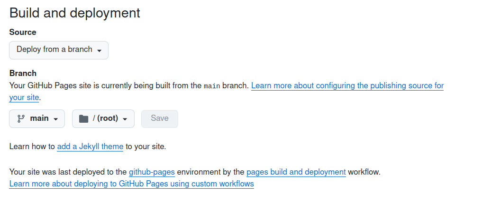

<h1 align="center">
   
  
   Quarto template RevealJS presentation 
</h1>

 

  <a href="https://biodiversitydata.github.io/quarto-template" target="_blank"><b>biodiversitydata.github.io/quarto-template</b></a></h4>

  
  
   
  

  <a href="#installation">Overview</a> •
  <a href="#content">Content</a> •
  <a href="#installation">Installation</a> •
  <a href="#requirements">Requirements</a> •
  <a href="#usage">Usage</a> •
  <a href="#citation">Citation</a> •
  <a href="#contributing">Contributing</a>

 

## Overview

This repository contains files and folders required to setup a minimal [Quarto HTML Presentation](https://quarto.org/docs/presentations/) based on [RevealJS](https://quarto.org/docs/presentations/revealjs/) framework.

## Installation

This repository is a GitHub [Template Repository](https://docs.github.com/en/repositories/creating-and-managing-repositories/creating-a-template-repository). You can generate a new repository with the same directory structure, branches, and files.

Proceed as follow:

- Create a new repository
- Select `biodiversitydata/quarto-template` in **Repository template**
- Click on **Create**
- Clone your new repository

If you want to deploy the HTML presentation (for public repository only) on GitHub, proceed as follow:

- Click on **Settings** of your repository
- In the tab **Pages** use this configuration and click on **Save**:

## Requirements

## Content

...

## Usage

...

## Citation

...

## Contributing

...
