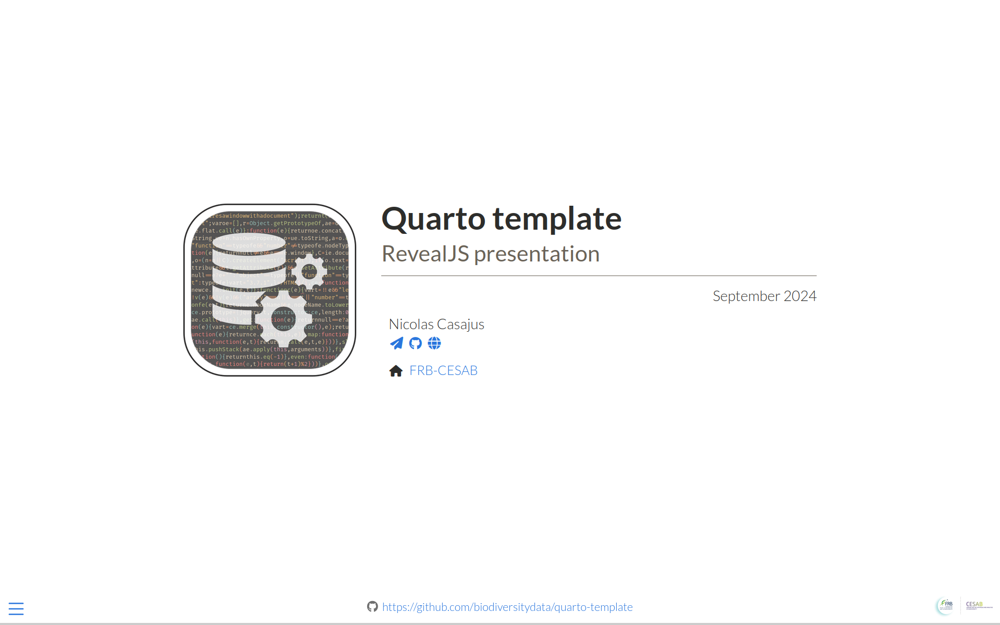

# Quarto template - RevealJS


<h1 align="center">
  <br>
  <a href="https://biodiversitydata.github.io/quarto-template"></a>
  <br>Quarto template<br/>RevealJS presentation<br>
</h1>

<br>

<p align="center">
  <a href="https://biodiversitydata.github.io/quarto-template" target="_blank"><b>biodiversitydata.github.io/quarto-template</b></a></h4>
</p>

<p align="center">
  <a href="https://quarto.org/">
    
  </a>
  <a href="https://choosealicense.com/licenses/cc-by-4.0/">
    
  </a>
  <br/>
  <a href="https://github.com/biodiversitydata/quarto-template/actions/workflows/pages/pages-build-deployment">
    
  </a>
</p>

<p align="center">
  <a href="#installation">Installation</a> •
  <a href="#content">Content</a> •
  <a href="#usage">Usage</a> •
  <a href="#citation">Citation</a> •
  <a href="#contributing">Contributing</a>
</p>



<br>


## Installation

```sh
quarto add quarto-ext/fontawesome
```


## Content

...


## Usage

...


## Citation

...

## Contributing

...
