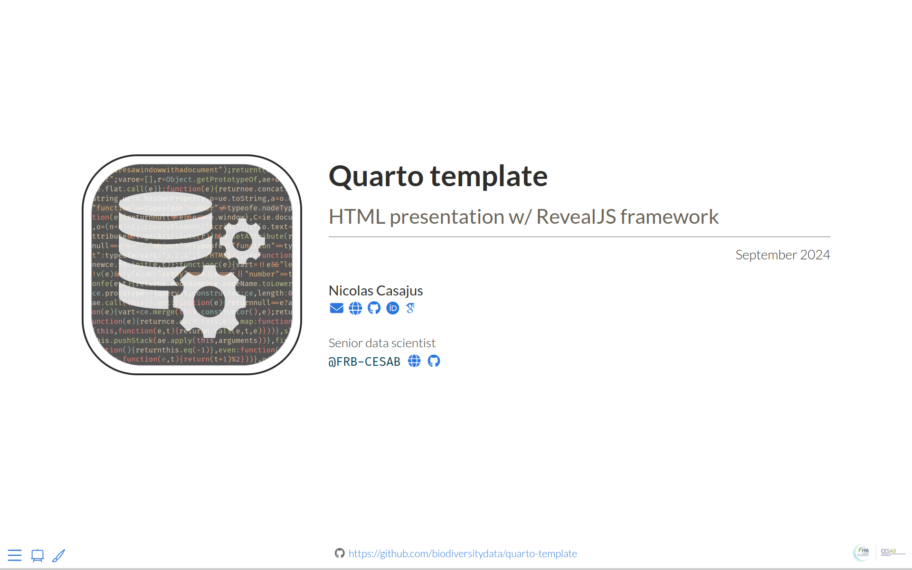

<!-- Logo & Title -->

<h1 align="center">
   
  
   
  Quarto template
   
  HTML presentation w/ RevealJS
   
</h1>

<!-- View presentation -->

 

  <a href="https://biodiversitydata.github.io/quarto-template" target="_blank"><b>View presentation</b></a>

 

<!-- Badges -->

  <!-- Quarto -->
  
  
  <!-- License -->
  
  
   
  
  <!-- Quarto render -->
  
  
  <!-- GitHub deployment -->
  

<!-- Table of content -->

  <a href="#overview">Overview</a> •
  <a href="#features">Features</a> •
  <a href="#usage">Usage</a> •
  <a href="#citation">Citation</a> •
  <a href="#contributing">Contributing</a> •
  <a href="#acknowledgments">Acknowledgments</a>

 

## Overview

This repository contains files and folders required to setup a minimal [Quarto HTML Presentation](https://quarto.org/docs/presentations/) based on the [RevealJS](https://quarto.org/docs/presentations/revealjs/) framework with a custom CSS theme.
This is a [Template Repository](https://docs.github.com/en/repositories/creating-and-managing-repositories/creating-a-template-repository) and you can generate a new repository from this template with the same directory structure, branches, and files.

## Features

- Basics of Quarto presentation (title slide, two column slides, code block, images and tables)
- Custom CSS style
- Emoji support
- [Fontawesome](https://github.com/quarto-ext/fontawesome) & [Academicons](https://github.com/schochastics/academicons) extensions
- Complete repository structure
- GitHub Action to automatically render `index.qmd`
- Website deployment on `gh-pages` branch

## Usage

A dedicated Wiki is available [**here**](https://github.com/biodiversitydata/quarto-template/wiki/).

- Read the [Installation](https://github.com/biodiversitydata/quarto-template/wiki/Installation) page to learn how to use this template.
- Read the [Content](https://github.com/biodiversitydata/quarto-template/wiki/Content) page to discover the role of each file.
- Read the [Usage](https://github.com/biodiversitydata/quarto-template/wiki/Usage) page to start writing your own presentation.

## Citation

Casajus N (2024) _A Quarto template for HTML presentation with RevealJS framework_. <https://github.com/biodiversitydata/quarto-template/>.

## Contributing

All types of contributions are encouraged and valued. For more information, check out our [Contributor Guidelines](https://github.com/biodiversitydata/quarto-template/blob/main/CONTRIBUTING.md).

Please note that the `quarto-template` project is released with a [Contributor Code of Conduct](https://contributor-covenant.org/version/2/1/CODE_OF_CONDUCT.html). By contributing to this project, you agree to abide by its terms.

## Acknowledgments

This project has been developed for the [FRB-CESAB](https://www.fondationbiodiversite.fr/en/about-the-foundation/le-cesab/) training courses [program](https://frbcesab.github.io/content/courses.html).
